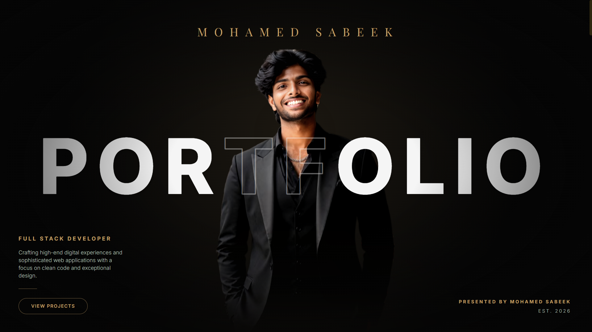

# 🚀 Mohamed Sabeek H — Developer Portfolio

A premium modern portfolio website built to showcase my projects, technical skills, certifications, coding achievements, professional experience, and client work.

Designed with a focus on performance, responsiveness, modern UI/UX, and professional presentation.

---

## 🌐 Live Website

🔗 https://myportfolio-alpha-gules-77.vercel.app/

---

## 📸 Preview

<!-- Add portfolio screenshot here -->



---

## ✨ Features

### 👨‍💻 Professional Presentation
- Modern premium portfolio design
- Responsive across desktop, tablet, and mobile
- Smooth scrolling experience
- Professional developer branding

### 📂 Featured Projects Showcase
- Interactive project gallery
- Featured projects section
- Dedicated project details view
- GitHub and Live Demo integration

### 🏆 Certifications & Achievements
- Internship certificates
- Professional certifications
- Hackathon participation records
- Academic achievements

### 📊 Professional Overview
- Education details
- Internship experience
- Coding profiles
- Areas of interest
- Technical focus areas

### 💻 Coding Profiles Integration
- LeetCode achievements
- SkillRack achievements
- Problem-solving statistics
- Competitive programming highlights

### 📞 Contact Section
- Professional contact form
- Email integration
- Social profile links
- Easy recruiter communication

### 🎨 Premium UI/UX
- Dark premium theme
- Gold accent design system
- Smooth animations
- Modern card layouts
- Consistent visual hierarchy

---

## 🛠️ Tech Stack

### Frontend

- React 19
- Vite
- JavaScript (ES6+)
- Tailwind CSS
- Framer Motion
- Lucide React

### Deployment

- Vercel

---

## 📂 Featured Projects

### 🎓 SECE SmartClass
Integrated Academic Management Platform featuring:

- Live classroom management
- Attendance analytics
- Jitsi Meet integration
- Teacher & student dashboards
- Academic workflow automation

### 🧠 CrackIt
Competitive Exam Preparation Platform featuring:

- Mock tests
- AI Mentor
- Current affairs
- Study materials
- Performance analytics

### 🤖 Arivon
AI-Powered Career Intelligence Platform featuring:

- Personalized job matching
- Skill gap analysis
- AI Career Assistant (Llama 3)
- 2-level skill verification (MCQ + GitHub)
- Smart analytics dashboard

### 🍴 Al Safi Beda
Client project for a homemade food brand featuring:

- Product showcase
- WhatsApp ordering
- Food gallery
- Customer testimonials
- Business landing page

### 💼 Additional Projects
More projects available through the complete projects gallery.

---

## 📜 Certifications

Highlights include:

- MERN Stack Internship
- Mastering Data Structures & Algorithms using C and C++
- Guidewire DEVTrails Hackathon
- Origin 24 Hours Hackathon
- CodeSprint 2026

---

## 🎯 Skills

### Frontend
- React.js
- JavaScript
- HTML5
- CSS3
- Tailwind CSS

### Backend
- Node.js
- Express.js
- Python
- Django
- Java
- Spring Boot
- FastAPI

### Database
- MongoDB
- MySQL

### Cloud & DevOps
- Docker
- Kubernetes
- AWS (Learning)

### Tools
- Git
- GitHub
- Postman
- VS Code

---

## 📈 Coding Profiles

### LeetCode
- 130+ Problems Solved
- Active Competitive Programming Practice

### SkillRack
- 1000+ Problems Solved
- 15+ Certificates
- 287+ Bronze Badges

---

## ⚙️ Installation

Clone the repository:

```bash
git clone https://github.com/Mohamed-sabeek/portfolio.git
```

Move into project directory:

```bash
cd portfolio
```

Install dependencies:

```bash
npm install
```

Run development server:

```bash
npm run dev
```

Build production version:

```bash
npm run build
```

Preview production build:

```bash
npm run preview
```

---

## 📬 Connect With Me

### Portfolio
🔗 https://myportfolio-alpha-gules-77.vercel.app/

### GitHub
🔗 https://github.com/Mohamed-sabeek

### LinkedIn
🔗 https://www.linkedin.com/in/mohamed-sabeek-1a272a327/

### LeetCode
🔗 https://leetcode.com/u/Yn7yECNe5s/

### SkillRack
🔗 https://www.skillrack.com/faces/resume.xhtml?id=515472&key=d180f70d334d6217e79b0cb1d7657530de1f4a8f

### Email
📧 safeeofficial1730@gmail.com

---

## 👨‍💻 Author

**Mohamed Sabeek H**

B.Tech Information Technology  
Sri Eshwar College of Engineering

Passionate Full Stack Developer focused on building scalable web applications, modern user experiences, and real-world software solutions.

---

⭐ If you like this portfolio, consider giving the repository a star.
